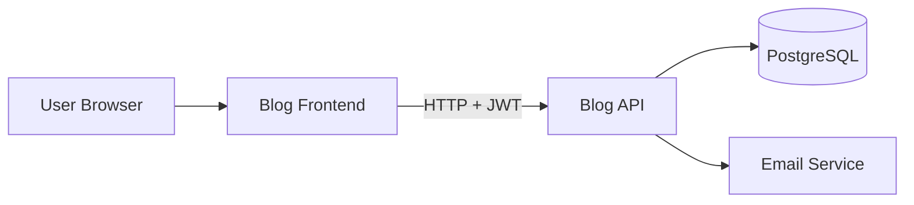
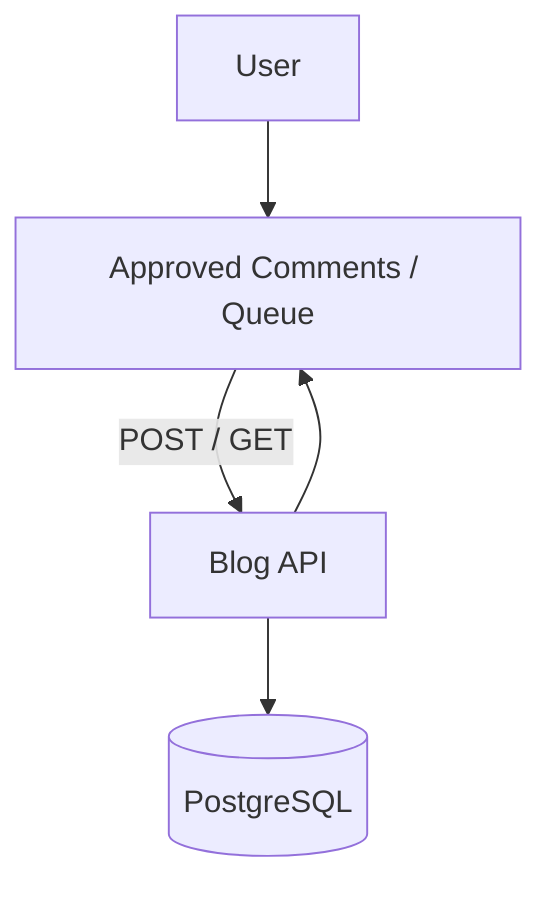

# Blog Frontend

The **Blog Frontend** is a Next.js/React application for managing and viewing blog posts. It integrates with **Blog Backend API** to create, read, update, and delete posts, and includes **email verification** for secure user registration.
Blog Backend: https://github.com/rabebe/blog-api

---

## Overview

Users can:

- View all blog posts
- View approved comments
- Submit new comments (authenticated users)
- Admins can moderate pending comments (approve/reject)
- Admin-only post creation, editing, and deletion
- Verify email addresses for account security

---

## Key Features

- Clean, responsive UI for desktop and mobile
- Public comment list per post
- Admin comment queue for moderation
- Email verification for new users
- Integration with backend API (Fetch API)
- Error handling and loading indicators

---

## Tech Stack

- **Framework:** Next.js (React)
- **Language:** TypeScript
- **Styling:** Tailwind CSS
- **Data Fetching:** Fetch API
- **Auth Handling:** JWT via HTTP-only cookies
- **Deployment:** Vercel

---

## System Architecture

### Flowchart


### Comments Flow


---

## Project Structure
```
src/
├── app/
│   ├── page.tsx
│   ├── verify-email/
│   └── layout.tsx
├── components/
│   ├── PostCard.tsx
│   ├── PostForm.tsx
│   ├── CommentList.tsx      # Displays approved comments
│   └── AdminCommentList.tsx # Admin moderation queue
├── lib/
│   └── api.ts
├── styles/
│   └── globals.css
```

---

## Setup & Local development
### Prerequisites
- Node.js 18+
- Running instance of Blog API

### Installation
```
git clone https://github.com/rabebe/blog-frontend.git
cd blog-frontend
npm install
```

### Environment Variables
Create .env.local:
```
NEXT_PUBLIC_API_URL=http://localhost:5000
```

### Run locally
```
npm run dev
```
Access at http://localhost:3000

---

## Available Scripts

| Script | Description |
| --- | --- |
| `npm run dev` | Starts the development server |
| `npm run build` | Builds the production version |
| `npm run start` | Runs the production build locally |
| `npm run lint` | Runs ESLint to check code quality |
| `npm run format` | Runs Prettier to format code |

---

## Deployment
- Deploy to Vercel or preferred hosting
- Set environment variables in hosting platform

---

## Related Repositories
- Blog API (Backend): https://github.com/rabebe/blog-api