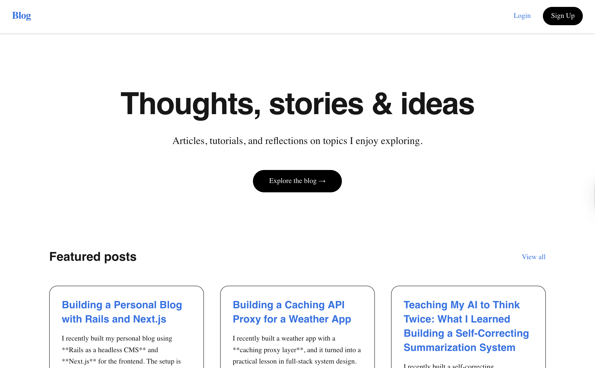
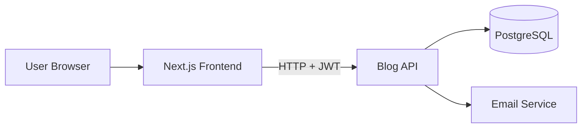
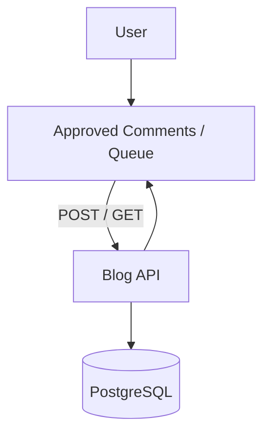

# Blog Frontend

A modern, responsive Next.js application acting as a headless consumer for a [Rails Backend API](https://github.com/rabebe/blog-api).
This project demonstrates a clean separation of concerns: Rails handles data, authentication, and business logic, while Next.js focuses on performance, SEO, and user experience.

---

## Key Features
- Public blog with posts and comments
- Admin dashboard with full CRUD capabilities
- Comment moderation queue
- Role-Based Access Control (admin vs user)
- Email verification enforced at login
- JWT-based authentication with persistent sessions
- Fully decoupled frontend consuming a Rails JSON API

---
## Interface Preview


---


## Live Workflow Demo

Admin Comment Moderation Flow

---

## Tech Stack

- **Framework:** Next.js (React) with TypeScript
- **Styling:** Tailwind CSS (utility-first, responsive design)
- **Authentication:** JWT-based authentication with client-side state persistence and a global `authChange` event system
- **Architecture:** Headless CMS pattern using Rails as a JSON API

---

## Authentication & Authorization Flow
The application implements an authentication gate with the following requirements:
- **Email Verification Gate:** Users cannot log in until their email is verified via Rails backend.
- **Role-Based Access Control (RBAC):** Admin routes (e.g., Dashboard, moderation) are conditionally accessible.
- **Session Persistence:** JWT tokens and user metadata are stored client-side and accessed via a centralized `apiFetch` wrapper to ensure consistent headers, error handling, and logout behaviour.

```TypeScript
// Typed representation of authenticated users
export type StoredUser = {
  username: string
  role: "admin" | "user"
  emailVerified: boolean
}
```

---

## System Architecture

### Flowchart


### Comments Flow


---

## Project Structure
```
src/
├── app/
│   ├── page.tsx
│   ├── verify-email/
│   └── layout.tsx
├── components/
│   ├── PostCard.tsx
│   ├── PostForm.tsx
│   ├── CommentList.tsx      # Displays approved comments
│   └── AdminCommentList.tsx # Admin moderation queue
├── hooks/
│   └── useAuth.ts
├── lib/
│   └── api.ts
│   └── auth.ts
├── styles/
│   └── globals.css
```

---

## Setup & Local development
### Prerequisites
- Node.js 18+
- Running instance of Blog API

### Installation
```
git clone https://github.com/rabebe/blog-frontend.git
cd blog-frontend
npm install
```

### Environment Variables
Create .env.local:
```
NEXT_PUBLIC_API_URL=http://localhost:3000
```

### Run locally
```
npm run dev
```
Access at http://localhost:3002

---

## Available Scripts

| Script | Description |
| --- | --- |
| `npm run dev` | Starts the development server |
| `npm run build` | Builds the production version |
| `npm run start` | Runs the production build locally |
| `npm run lint` | Runs ESLint to check code quality |
| `npm run format` | Runs Prettier to format code |

---

## Deployment
- Deploy to Vercel or preferred hosting
- Set environment variables in hosting platform

---

## Related Repositories
- Blog API (Backend): https://github.com/rabebe/blog-api

## License
MIT License